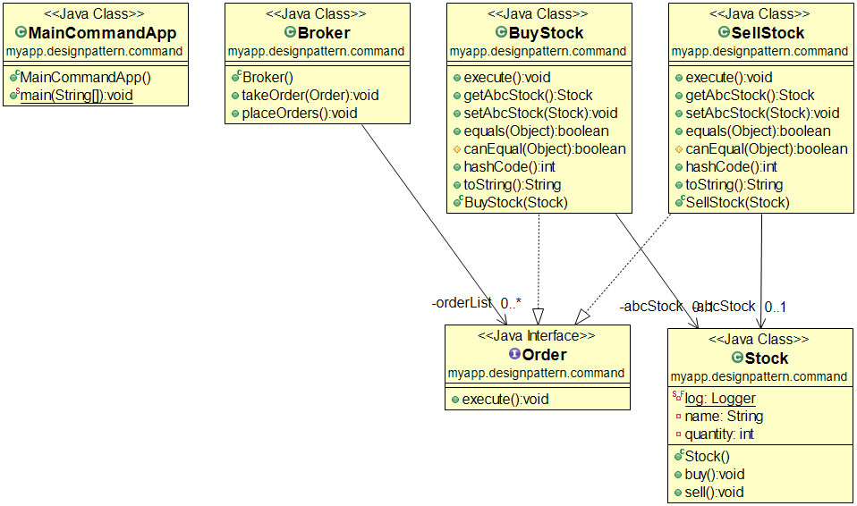

설명
------------------
> 커맨드 패턴은 객체의 행위 (메서드) 를 클래스로 만들어 캡슐화 하는 패턴

* 실행될 기능을 캡슐화함으로써 주어진 여러 기능을 실행할 수 있는 재사용성이 높은 클래스를 설계하는 패턴임. 즉 이벤트가 발생했을 때 실행될 기능이 다양하면서도 변경이 필요한 경우에 이벤트를 발생시키는 클래스를 변경하지 않고 재사용하고자 할 때 유용함.

* 실행될 기능을 캡슐화함으로써 기능의 실행을 요구하는 호출자(Invoker) 클래스와 실제 기능을 실행하는 수신자(Receiver) 클래스 사이의 의존성을 제거함.

* 실행될 기능의 변경에도 호출자 클래스를 수정 없이 그대로 사용 할 수 있도록 해줌.

### Command - `Order` Interface
  - 실행될 기능에 대한 인터페이스
  - 실행될 기능을 execute 메서드로 선언함

### ConcreteCommand - `BuyStock`, `SellStock` Class
  - 실제로 실행되는 기능을 구현
  - Command라는 인터페이스를 구현함

### Invoker - `Broker` Class
  - 기능의 실행을 요청하는 호출자 클래스

### Receiver - `Stock` Class
  - ConcreteCommand에서 execute 메서드를 구현할 때 필요한 클래스
  - ConcreteCommand의 기능을 실행하기 위해 사용하는 수신자 클래스

예제
------------------
