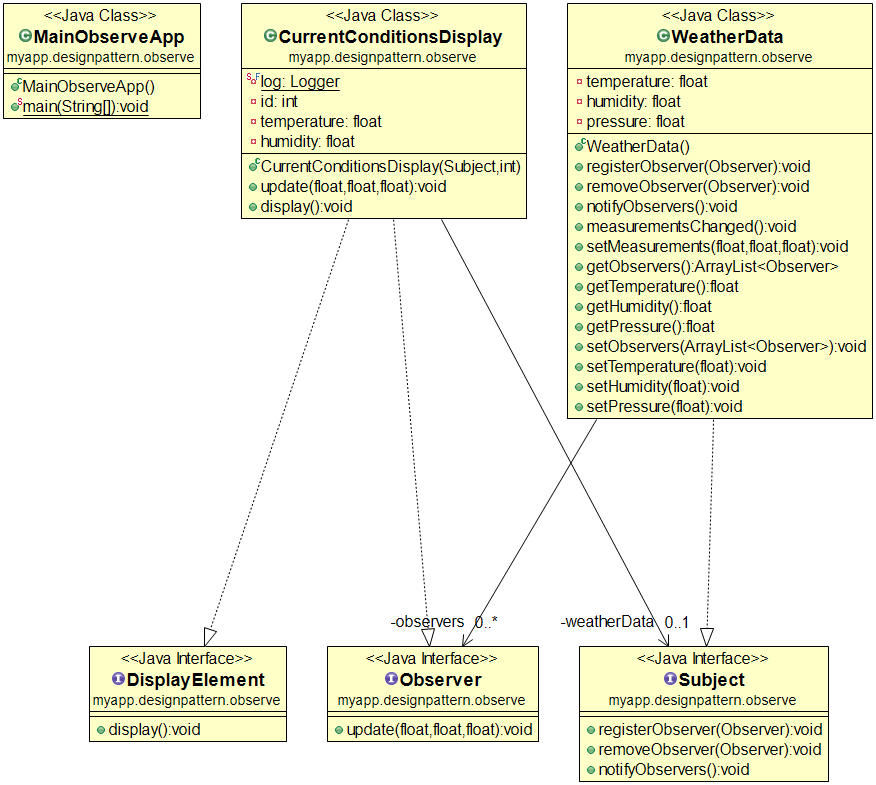

설명
------------------
* Subject에 여러 Observer를 `Register`해 두고, `Notify`를 하게 되면 루프를 돌면서 각 Observer를 `Update`하는 패턴임.
* 옵저버 패턴이라는 이름이 좀 미묘함. 
* 스스로 감시하다가 변화를 알아차리는 것이 아니라, 변화를 통지받고 알게 되기 때문이다. 그래서 게시-구독 패턴이라는 별명도 있음.

예제
------------------

