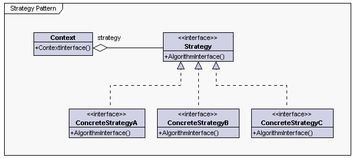

설명
------------------

> 실행 중에 알고리즘을 선택할 수 있게 하는 행위 소프트웨어 디자인 패턴

* 특정한 계열의 알고리즘들을 정의하고
* 각 알고리즘을 캡슐화하며
* 이 알고리즘들을 해당 계열 안에서 상호 교체가 가능하게 만든다. (OCP 수행)

### Context 
  - 특정 알고리즘을 사용하는 객체

### Strategy 
  - 특정한 알고리즘을 추상화된 인터페이스나 클래스로 정의한 오브젝트

### ConcreteStrategy 
  - Strategy 의 추상 메서드를 구현한 클래스

예제
------------------

